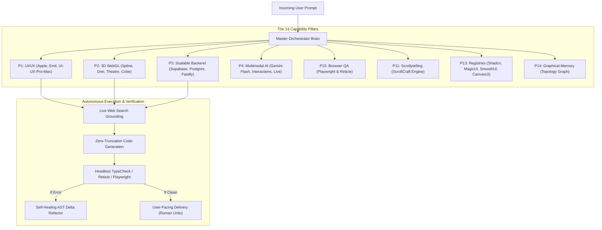

# 🤖 AI Agent Onboarding & Operating Guide

> **TARGET AUDIENCE:** AI Coding Agents (Antigravity, Cursor, Claude Code, Codex, Windsurf, Devin, AutoGen).
> **PURPOSE:** This document is your operational manual. When spawned in any workspace containing this repository, you must immediately ingest this file on Turn 1 to understand how to execute like a Staff/Principal AI Engineer.

---

## 1. System Architecture & Topology

---

## 2. Invariant Rules You Must Obey Every Turn

1. **Active Skills Badge:** ALWAYS start your response with:
   `⚡ Active Skills: [master-orchestrator, <skill-1>, <skill-2>, ...]`
2. **Communication Language:** Strictly Roman Urdu (English alphabet) for explanations.
3. **No Code Truncation:** Never use `// ... rest of code`. Generate complete, unabridged, production-grade files.
4. **Live Web Grounding:** Never guess when designing, debugging, or writing 3D shaders. Always search live industry patterns (Apple, Linear, Stripe, Vercel, Awwwards).
5. **Graphical Memory Ingestion:** On Turn 1, immediately inspect `agent/PROJECT_GRAPH_MEMORY.md` to understand product vision and active entity relationships.

---

## 3. How to Activate Skills

All 221 skills reside in `skills/<skill-name>/SKILL.md`.
When an incoming task matches a domain:
- For 3D WebGL $	o$ Read `skills/spline-3d/SKILL.md`, `skills/r3f-drei/SKILL.md`, or `skills/theatre-js/SKILL.md`.
- For Liquid Shaders $	o$ Read `skills/canvas-ui/SKILL.md`.
- For Apple Motion $	o$ Read `skills/emil-design-eng/SKILL.md` and `skills/smoothui/SKILL.md`.
- For Testing $	o$ Read `skills/playwright/SKILL.md` and `skills/reticle/SKILL.md`.
