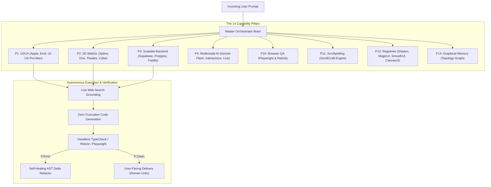

# ⚡ Master Orchestrator: The Supreme Autonomous Multi-Agent Intelligence Layer

> **The definitive production-grade AI agent skills ecosystem.** Bridges 221+ specialized domain skills, 12 MCP servers, Persistent Graphical Knowledge Memory, and the 5 Breakthrough Self-Healing Engines into a single unified intelligence layer.

Compatible out-of-the-box with **Antigravity**, **Cursor IDE (`.cursorrules`)**, **Claude Code CLI (`CLAUDE.md`)**, **Codex (`AGENTS.md`)**, and **Windsurf**.

---

## 🌟 Core Architecture & Capabilities



- 🧠 **Autonomous Graphical Knowledge Memory (Pillar 14):** Zero context-loss across multiple chats and subagents using persistent entity graphs (`agent/PROJECT_GRAPH_MEMORY.md`).
- 🔄 **5 Breakthrough Engines:**
  1. *Grounded Multi-Agent Reflection & Web-Grounded Self-Healing Loop* (Instant auto-fix on errors before user inspection).
  2. *Anticipatory 3-Step Predictive Intent Graph* (Proactively plans UI, Backend DB, and Delight layers).
  3. *60 FPS & GPU Budget Gatekeeper* (Adaptive WebGL downsampling for silky-smooth mobile performance).
  4. *Visual-Spatial CSS AST Pinning* (Zero layout shift or sibling style bleeding).
  5. *Anti-Slop Aesthetic Firewall* (Enforces Apple HIG, Emil Kowalski spring physics, and bespoke obsidian dark glass).
- 🌐 **Omnipresent Live Web Grounding:** Unrestricted capacity cross-examining real-world production code (Apple, Linear, Stripe, Vercel, Awwwards, GitHub RFCs).
- 🎨 **Component Harvesting Suite:** Instant access to 100% free registries (`shadcn`, `magicui`, `smoothui`, `reactbits`, `canvas-ui`, `uiverse`) + quota-guarded `21st.dev`.
- 🕹️ **Unified 3D Web Suite:** Native support for `@splinetool/react-spline`, `r3f-drei`, `@theatre/core`, `cobe`, and Three.js scrollytelling.
- 🧪 **Enterprise Browser Automation & In-App QA:** Deep headless Playwright automation + Reticle assertion suite.

---

## 🚀 Quick Start & Installation

### Option 1: One-Click Universal Setup (Windows & Mac)
```bash
# 1. Clone the repository
git clone https://github.com/yautomationresearch-cmyk/Master-Orchestrator.git
cd Master-Orchestrator

# 2. Run the one-click installer
./install.ps1    # Windows PowerShell
# or
./install.sh     # Mac / Linux Bash
```

### Option 2: Use Inside Any Project Directly
Simply copy or link `AGENTS.md` and the `skills/` folder into your project's `.agents/skills` directory. Any AI agent (Codex, Cursor, Claude Code, Antigravity) will instantly adopt Master Orchestrator protocols!

---

## 🤖 Dedicated Agent Guide
For AI coding agents executing within this workspace, read **[AGENT_ONBOARDING.md](./AGENT_ONBOARDING.md)** for operational instructions.
