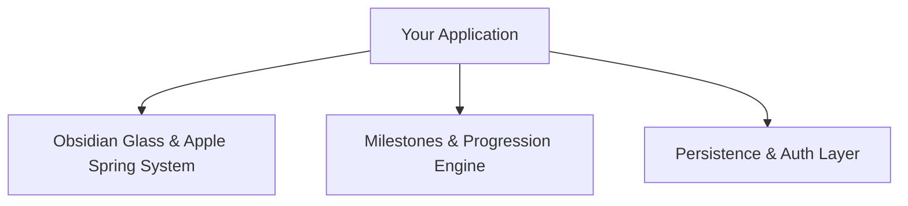

# 🕸️ Project Knowledge Graph & Topological Memory (Template)

> **System Invariant:** This file is the single source of truth for any project across all chats, subagents, and development sessions. Any new agent or conversation MUST read this file on Turn 1 to achieve 100% immediate context synchronization.

---

## 1. Visual Architecture Topology (Mermaid Knowledge Graph)

## 2. Active Entity Nodes
- **VisionNode:** Core product goal, target user, target aesthetic.
- **DesignTokenNode:** Color palette (HSL), typography, spring curves, elevation.
- **DatabaseNode:** PostgreSQL / Supabase schema, tables, RLS policies.
